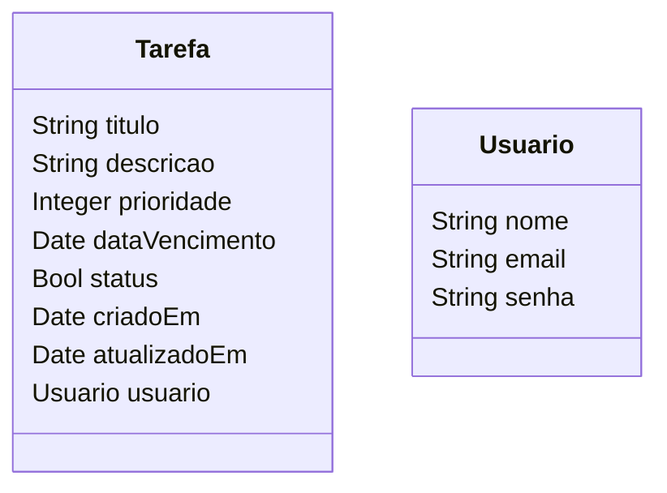
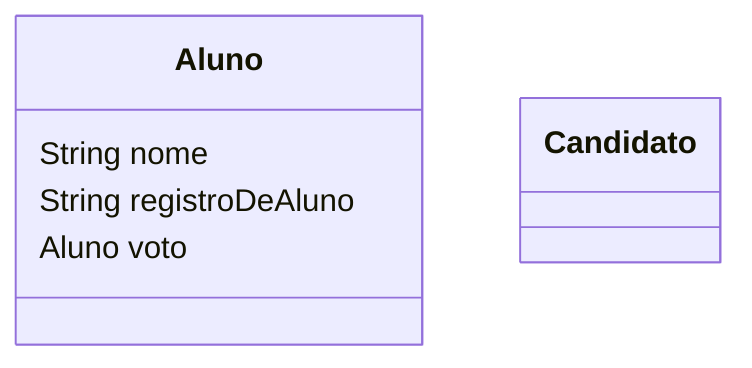

**Matéria:** [[OOP]]
**Tópicos:** #

**Problema 1: Gerenciador de Tarefas**  
Você está desenvolvendo um aplicativo de tarefas para ajudar usuários a organizarem suas atividades diárias. Cada tarefa deve ter um título, uma descrição, uma data de vencimento e uma prioridade. Os usuários poderão marcar tarefas como concluídas ou excluí-las quando não forem mais necessárias. O sistema deve permitir visualizar, adicionar, remover e atualizar tarefas de forma simples.

**Problema 2: Sistema de Votação Online**  
Uma escola quer criar um sistema online para eleger o representante de turma. Cada aluno poderá votar uma única vez em um dos candidatos. O sistema deve registrar os votos, garantir que ninguém vote duas vezes e exibir o vencedor ao final da votação. A proposta é criar uma aplicação simples e segura para conduzir eleições escolares.

